### Hi there 👋

I'm an SRE & Platform Engineer with roots in Linux system administration. I build tools in **Go**, **Python**, and **Bash** to solve infrastructure problems — from cloud-native IPAM to disconnected environment tooling.

#### Currently working on
- 🕸️ [grapheon](https://github.com/BadgerOps/grapheon) — Network intelligence platform that aggregates scan data (nmap, netstat, arp) into graph visualizations (Python/FastAPI + React)
- 🌐 [CloudPAM](https://github.com/BadgerOps/cloudpam) — A lightweight, cloud-native IP Address Management solution for AWS/GCP (Go + Alpine.js)
- 📋 [WOTSapp](https://github.com/BadgerOps/WOTSapp) — Military training communication platform for instructors and students (React + Firebase)

#### Popular & Featured Projects
- ⭐ [salt-workspace](https://github.com/BadgerOps/salt-workspace) — Salt configuration management workspace (16 stars)
- 📦 [epel-offline-sync](https://github.com/BadgerOps/epel-offline-sync) — Sync EPEL repos for disconnected environments (Python)
- 🔄 [ocpsync](https://github.com/BadgerOps/ocpsync) — Sync artifacts for OpenShift in air-gapped environments (Go)
- 🎤 [bsides-if-2022](https://github.com/BadgerOps/bsides-if-2022) — BSides Idaho Falls 2022 conference talk materials

#### Security Research

Discovered hardcoded secrets vulnerabilities in Red Hat's Mirror Registry, resulting in 4 CVEs:
- [CVE-2024-3622](https://nvd.nist.gov/vuln/detail/CVE-2024-3622) — Plaintext CSRF secret key
- [CVE-2024-3623](https://nvd.nist.gov/vuln/detail/CVE-2024-3623) — Default database secret key in plain-text
- [CVE-2024-3624](https://nvd.nist.gov/vuln/detail/CVE-2024-3624) — Database user and password stored in plain-text
- [CVE-2024-3625](https://nvd.nist.gov/vuln/detail/CVE-2024-3625) — Redis password stored in plain-text

Read more: [CVE disclosure process writeup](https://blog.badgerops.net/cves/)

#### Upstream Contributions

- **[quay/mirror-registry](https://github.com/quay/mirror-registry)** — 4 merged PRs fixing secrets handling and security issues
- **[keycloak/keycloak](https://github.com/keycloak/keycloak)** — Operator documentation and TLS configuration fixes
- **[openshift/oc-mirror](https://github.com/openshift/oc-mirror)** — Code cleanup contributions

#### Ask me about
- Observability (metrics, logs, traces)
- Salt, Ansible, and configuration management at scale
- Disconnected/air-gapped environment challenges
- OpenShift & container orchestration

#### Connect
- 📝 [blog.badgerops.net](https://blog.badgerops.net)
- 🐘 [mastodon.social/@badgerops](https://mastodon.social/@badgerops)
- 🐦 [@badgerops](https://twitter.com/badgerops)

#### GitHub Stats

  
  

> Stats are refreshed weekly via [GitHub Actions](.github/workflows/update-stats.yml) using [lowlighter/metrics](https://github.com/lowlighter/metrics).

#### Tech Stack

